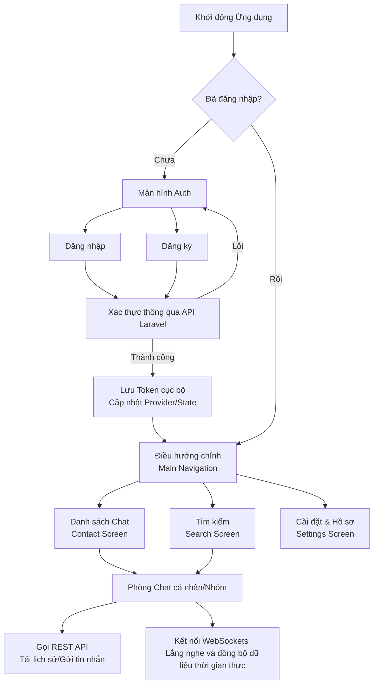

# Nhóm 7: Xây dựng ứng dụng gửi nhận tin nhắn thời gian thực

# Thành viên nhóm

- Hoàng Minh Quang
- Nguyễn Quý Khôi
- Nghiêm Xuân Mạnh
- Nguyễn Thị Huyền

# Cách chạy
- Chạy lệnh sau để tải thư viện
```bash
flutter pub get
```

- Sau đó tạo file .env 

```bash
API_URL=https://moxchat-production.up.railway.app
```

- Cuối cùng chạy lệnh sau để chạy ứng dụng
```bash
flutter run 
```

# Tech Stack

- Flutter
- Laravel
- MySQL
- Websocket

# Cấu trúc thư mục (Source Code)

Dưới đây là cấu trúc thư mục chính trong `lib` của ứng dụng:

```text
lib/
├── Auth/              # Chứa các màn hình và logic liên quan đến xác thực người dùng (Đăng nhập, Đăng ký...)
├── Views/             # Chứa các màn hình (screens) giao diện người dùng chính
│   └── widgets/       # Chứa các UI component nhỏ dùng chung, có thể tái sử dụng
├── models/            # Chứa các class định nghĩa cấu trúc đối tượng dữ liệu
├── providers/         # Chứa quản lý trạng thái của ứng dụng (State management)
├── services/          # Chứa logic nghiệp vụ, service tương tác dữ liệu
│   └── apis/          # Chứa các cấu hình endpoint và xử lý gọi API / WebSockets
├── theme/             # Chứa các thiết lập giao diện chung (màu sắc, typography, style...)
├── utils/             # Chứa các hàm tiện ích (helpers) dùng chung toàn dự án
│   └── constants/     # Chứa các biến hằng số, file cấu hình, đường dẫn assets
├── main-navigation.dart # File cấu hình điều hướng (Navigation), quản lý các luồng màn hình chính
└── main.dart          # Điểm khởi chạy (Entry point) của ứng dụng Flutter
```

# Sơ đồ Luồng hoạt động (Workflow)

Dưới đây là sơ đồ các luồng xử lý và tương tác chính của ứng dụng:


